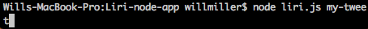
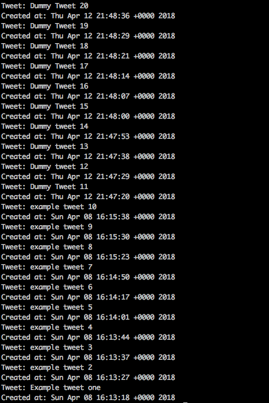
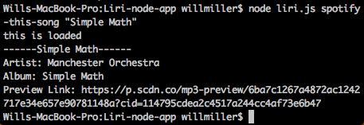
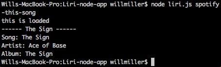
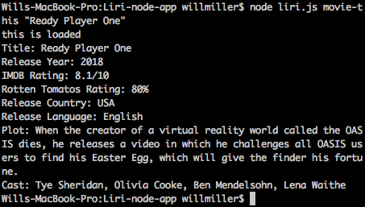
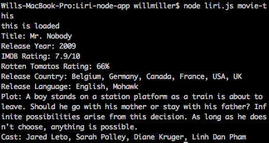
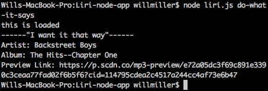
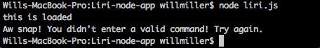

# Liri-node-app
Node.js Liri App

This is a LIRI (Language Interpretation and Recognition Interface), Liri is a command line node app that takes in commands and parameters and outputs data based on the parameters input into the command line.

There are four total commands you can input into the command line.
1. my-tweet
2. spotify-this-song
3. movie-this
4. do-what-it-says

Each command has its own action and reults that are posted to the command line.

"my-tweet" command prints the last twenty tweets from the twitter account (in this case it will print the last 20 tweets from a dummy account made for the purpose of showing how this app works.)
- ex. node liri.js my-tweet

"spotify-this-song" command requires a parameter to work. When the command is input into the command line with a parameter the app will output data about the parameter entered.
- ex. node liri.js spotify-this-song "paramater"

"movie-this" command requires a parameter to work. When the command is input into the command line with a parameter the app will output data about the parameter entered
- ex. node liri.js movie-this "paramater"

"do-what-it-says" command does not require a parameter to work. When this command is entered into the command line the internal logic of then app will do a spotify command of a predetermined song, then output the data based on the predetermined song.
- ex. node liri.js do-what-it-says

There is one more action that happens in this liri app as well. When no command is entered into the command line its going to post and error message telling you to enter a command.
- ex. node liri.js 

////////////////// Here are some examples! check it out! ////////////////////

